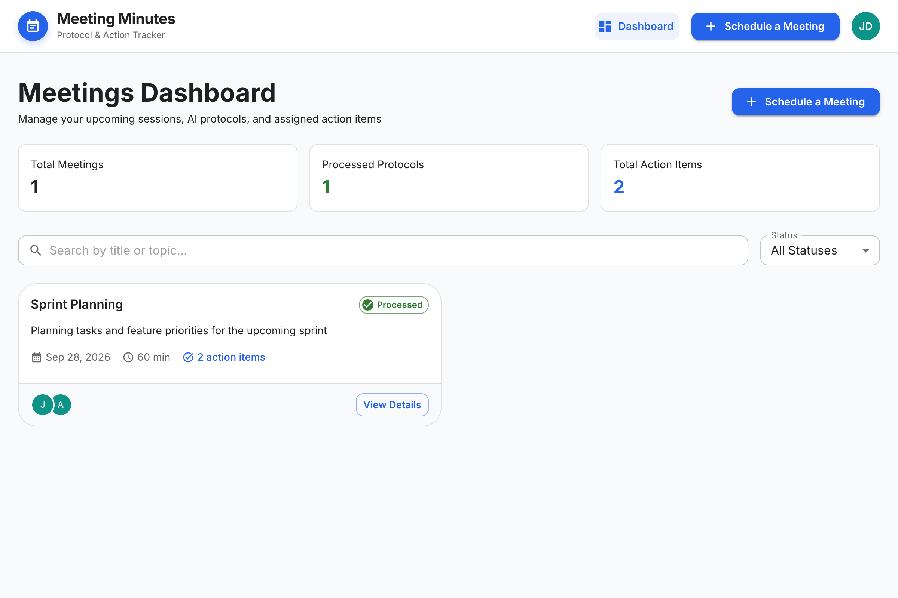
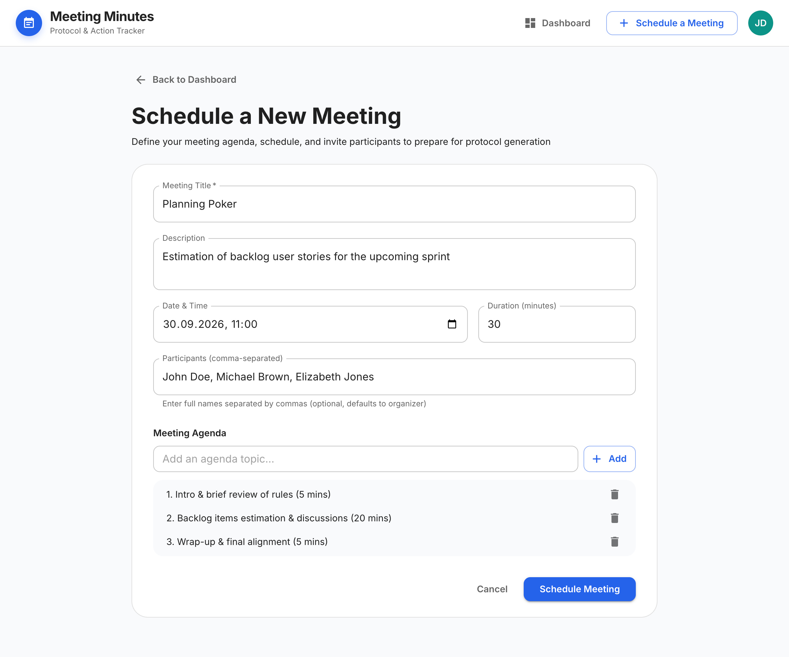
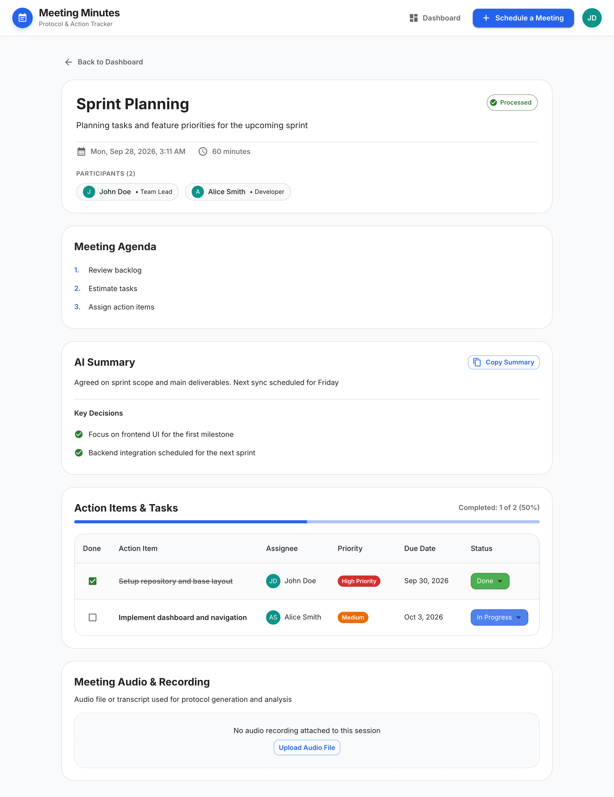

# Meeting Minutes

AI-driven meeting assistant for automated agenda planning, discussion transcription, summarization, and action item tracking.

## 1. Project Overview

The service streamlines organizational overhead around business meetings and ensures agreements are clearly documented. It provides tools to structure upcoming meeting agendas, upload discussion recordings or transcripts, extract key decisions and executive summaries via external AI models, and manage task assignments with deadlines in a unified workflow.

## 2. User Scenarios

1. **Agenda Planning & Scheduling:**
   An organizer sets up a new meeting session, defines the topic, date and time, invites participants, and drafts agenda points to provide alignment prior to the meeting
2. **Audio/Transcript Upload & AI Processing:**
   Following the discussion, a team member uploads an audio file or text notes. The system analyzes the input using an AI model to generate a summary, highlight decisions, and identify action items
3. **Action Items Tracking & Deadlines:**
   Participants review the generated meeting minutes, inspect assigned action items, check due dates, and update task progress (ToDo → In Progress → Done)

## 3. Application Screens

- `/` — **Meetings Dashboard:** Aggregated list of all planned and completed sessions with search filters and navigation controls
- `/meetings/create` — **Meeting Creation Form:** Page for scheduling a meeting including date, time, participants and agenda planning
- `/meetings/:id` — **Meeting Protocol & Insights:** Comprehensive view with meeting info, audio and transcript upload field, AI-generated summary, key decisions, and action items table with progress tracking

## 4. Tech Stack

- **Frontend:** React 19, TypeScript, Vite, Material UI
- **Backend:** Python 3.12+, FastAPI, SQLAlchemy 2.0, PostgreSQL, Docker

## 5. Data Model

| Entity | Description | Relationships |
| :--- | :--- | :--- |
| **Meeting** | Session details, AI summary, transcript, agenda, decisions | M:N with Participants, 1:N with Action Items |
| **Participant** | Team members (name, email, role, avatar) | M:N with Meetings, 1:N with Action Items |
| **Action Item** | Follow-up task with deadline, priority and status | Belongs to Meeting, optionally assigned to Participant |

## 6. Local Setup & Execution

### Prerequisites
- Node.js (v18+) & npm (v9+)
- Python (v3.12+)
- Docker & Docker Compose

### 1. Database Setup
Start the PostgreSQL container:
```bash
docker compose up -d
```
The database will be available at `localhost:5432` (database: `meeting_minutes`, user: `postgres`).

### 2. Backend Setup
1. Navigate to the backend directory and set up environment variables:
   ```bash
   cd backend
   cp .env.example .env
   ```
2. Create and activate a Python virtual environment:
   ```bash
   python -m venv venv
   source venv/bin/activate  # On Windows: venv\Scripts\activate
   ```
3. Install dependencies:
   ```bash
   pip install -r requirements.txt
   ```
4. Create database tables and seed initial demo data:
   ```bash
   python -m app.db.init_db
   ```
5. Start the backend development server:
   ```bash
   uvicorn app.main:app --reload --port 8000
   ```
   Swagger UI is available at [http://localhost:8000/docs](http://localhost:8000/docs).

### 3. Frontend Setup
1. Navigate to the client directory and install dependencies:
   ```bash
   cd frontend
   npm install
   ```
2. Start the Vite development server:
   ```bash
   npm run dev
   ```
3. Access the client app at [http://localhost:5173](http://localhost:5173).

## 7. Screenshots

### Meetings Dashboard (`/`)


### Meeting Creation Form (`/meetings/create`)


### Meeting Protocol & Action Items (`/meetings/:id`)

